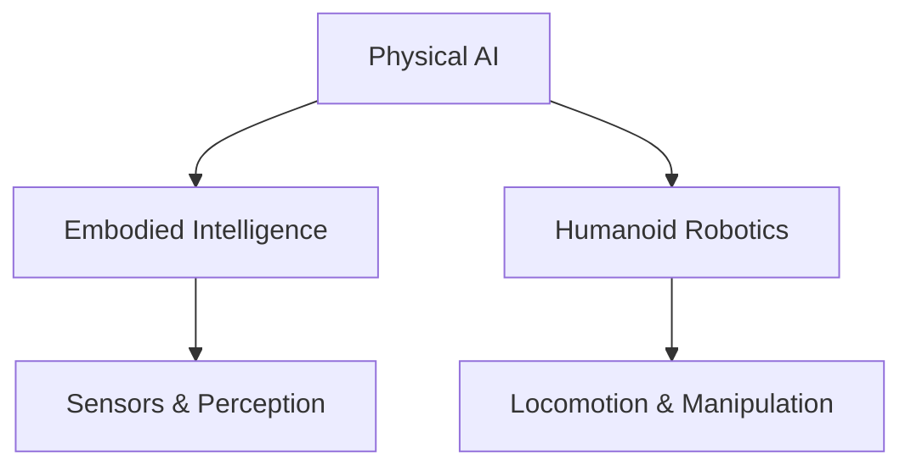

# Diagram Generation Pipeline

This directory contains diagrams for the Physical AI & Humanoid Robotics Textbook. The diagram generation pipeline supports multiple formats to create high-quality visualizations for robotics concepts.

## Supported Formats

1. **Mermaid**: For flowcharts, sequence diagrams, and state diagrams
2. **PlantUML**: For UML diagrams (class diagrams, sequence diagrams, etc.)
3. **SVG**: For custom vector graphics created with tools like Inkscape or Adobe Illustrator
4. **PNG**: For raster images when vector graphics aren't suitable

## File Organization

```
static/diagrams/
├── 01-physical-ai/          # Diagrams for Chapter 1: Foundations of Physical AI
├── 02-ros2-basics/          # Diagrams for Chapter 2: ROS 2 as the Robotic Nervous System
├── 03-simulation/           # Diagrams for Chapter 3: Simulation Pipelines
├── 04-isaac-platform/       # Diagrams for Chapter 4: NVIDIA Isaac Platform
├── 05-humanoid-robotics/    # Diagrams for Chapter 5: Humanoid Robotics Fundamentals
├── 06-vla-robotics/         # Diagrams for Chapter 6: Vision-Language-Action Robotics
├── 07-capstone/             # Diagrams for Chapter 7: Capstone Project
└── templates/               # Template diagrams that can be reused
```

## Mermaid Integration

Docusaurus supports Mermaid diagrams natively. To include a Mermaid diagram in your documentation:



## Diagram Creation Tips

1. Use consistent colors and styling across all diagrams
2. Ensure diagrams are accessible with appropriate alt text
3. Keep diagrams simple and focused on one concept at a time
4. Include captions explaining the key elements
5. Use vector formats (SVG) when possible for scalability

## Creating New Diagrams

### Using Mermaid
1. Create a Mermaid diagram using the [Mermaid Live Editor](https://mermaid.live/)
2. Save the source code in a `.mmd` file
3. Include directly in Markdown files using the Mermaid syntax

### Using PlantUML
1. Create PlantUML source files with `.puml` extension
2. Use the PlantUML server or CLI to generate images
3. Reference generated images in your documentation

### Using Vector Graphics
1. Create SVG diagrams with Inkscape (free) or Adobe Illustrator
2. Optimize SVG files for web using tools like SVGO
3. Place SVG files in the appropriate chapter directory

## Tools for Diagram Creation

- [Mermaid](https://mermaid.js.org/): Text-based diagrams
- [PlantUML](https://plantuml.com/): UML diagrams from text descriptions
- [Inkscape](https://inkscape.org/): Free vector graphics editor (SVG)
- [Draw.io](https://draw.io/): Browser-based diagramming tool
- [Excalidraw](https://excalidraw.com/): Virtual whiteboard for sketching hand-drawn like diagrams

## Accessibility Guidelines

1. All diagrams must have descriptive alt text
2. Use color-blind friendly palettes (tools like [ColorBrewer](https://colorbrewer2.org/) can help)
3. Provide textual descriptions of key relationships shown in diagrams
4. Ensure sufficient contrast ratios for text and visual elements